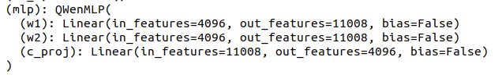
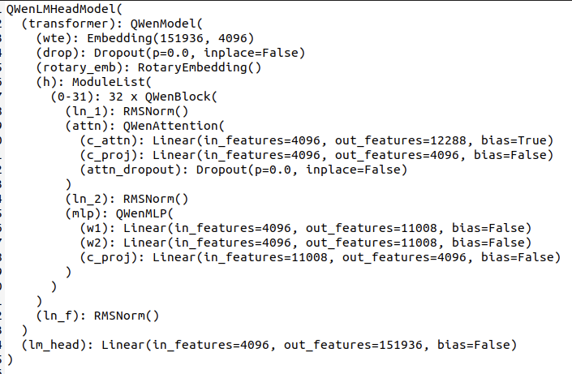
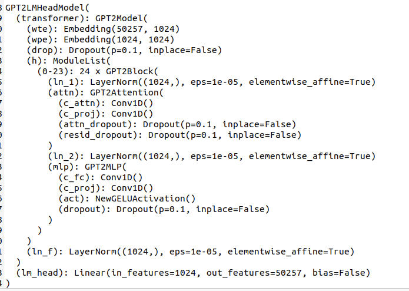
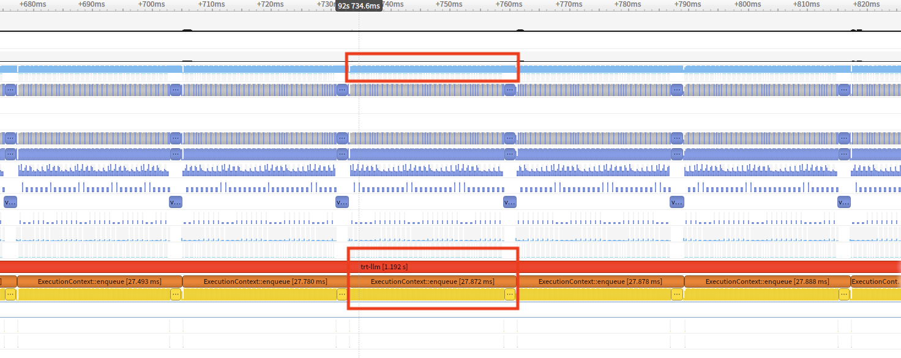

# Qwen-7B-chat-for-TRT-LLM
## 本项目是 NVIDIA TensorRT Hackathon 2023 的参赛题目
比赛链接为： [NVIDIA TensorRT Hackathon 2023](https://github.com/NVIDIA/trt-samples-for-hackathon-cn/tree/master/Hackathon2023) 

选题为以下的选项中的（2+4）：  
1.用TensorRT优化模型  
2.使用TensorRT-LLM实现新模型  
3.用TensorRT-LLM优化examples目录下的某个现有模型  
4.为TensorRT-LLM添加新feature，或者在模型上启用了现有feature  

原始模型为：[通义千问-7B-chat](https://huggingface.co/Qwen/Qwen-7B-Chat)  

通义千问-7B（Qwen-7B） 是阿里云研发的通义千问大模型系列的70亿参数规模的模型。Qwen-7B是基于Transformer的大语言模型, 在超大规模的预训练数据上进行训练得到。预训练数据类型多样，覆盖广泛，包括大量网络文本、专业书籍、代码等。同时，在Qwen-7B的基础上，我们使用对齐机制打造了基于大语言模型的AI助手Qwen-7B-Chat。Qwen-7B系列模型的特点包括：

1. **大规模高质量预训练数据**：我们使用了超过2.2万亿token的自建大规模预训练数据集进行语言模型的预训练。数据集包括文本和代码等多种数据类型，覆盖通用领域和专业领域。
2. **优秀的模型性能**：相比同规模的开源模型，Qwen-7B在多个评测数据集上具有显著优势，甚至超出12-13B等更大规模的模型。评测评估的能力范围包括自然语言理解与生成、数学运算解题、代码生成等。
3. **更好地支持多语言**：基于更大词表的分词器在分词上更高效，同时它对其他语言表现更加友好。用户可以在Qwen-7B的基础上更方便地训练特定语言的7B语言模型。
4. **8K的上下文长度**：Qwen-7B及Qwen-7B-Chat均能支持8K的上下文长度, 允许用户输入更长的prompt。
5. **支持插件调用**：Qwen-7B-Chat针对插件调用相关的对齐数据做了特定优化，当前模型能有效调用插件以及升级为Agent。
  
（注：* 2023年8月21日 阿里云了发布Qwen-7B-Chat的Int4量化模型，Qwen-7B-Chat-Int4。本项目先对fp16精度进行优化）

模型运行方法：  
确保docker中安装了transformers库 没有安装使用pip安装，
然后运行python3 Qwen-7B-chat-for-TRT-LLM/tensorrt_llm_july-release-v1/examples/qwen/Quickstart.py，保证原模型可以工作。

首先进行保存模型参数  
- cd tensorrt_llm_july-release-v1/examples/qwen/  
- python3 hf-qwen_convert.py -i Qwen/Qwen-7B-Chat -o ./c-model/Qwen --tensor-parallelism 1 --storage-type float16

构建trt-llm模型  
- python3 build.py --model_dir ./c-model/Qwen/1-gpu --use_gpt_attention_plugin float16 --dtype float16 --use_layernorm_plugin float16 --use_gemm_plugin float16 --max_batch_size 2

运行模型  
- python3 run.py --max_output_len 8

### 主要开发工作  
#### 开发工作的难点
在本项目中通过，重新构建qwen模型对原模型进行加速工作。  
- 深度学习为有向无环图，在且在trt-llm中为静态图
- 构建方法与pytorch的用法基本相同，使用python语言，使用tensorrt_llm_july-release-v1/tensorrt_llm的layes层进行搭建。当没有可使用的层时，使用functional.py中的算子自定义层。  
- 进行模型的编译，即将模型从python代码转换为在GPU上运行的算子，其方法与TRT本身较为类似。并序列化为文件
- 通过TRT-llm的API加载engine序列，并进行推理。

其中难点分为两个方面：  
- 首先是理解原模型的结构：  
在huggingface上下载qwen7b-chat的代码，或者使用Qwen-7B-chat-for-TRT-LLM/tensorrt_llm_july-release-v1/examples/qwen/Quickstart.py中的方法调试代码，打印出模型的形状，使用调试工具对模型结构进行观察，对比其与gpt2的区别。
1.qwen模型中使用了旋转编码的方式，给输入到attention的层中作为位置编码。  
2.attention中的MLP层使用了如下的结构：  
  
3、将旋转编码加入到模型中。使用numpy将旋转编码生成后使用constant函数直接放入模型的QWenAttention

- 其次：对比原模型与构建的trt-llm的每一层的层参数对比。对比后查找差距较大层进行精度调优，可以使用编写plugin或者提高参数的精度，对比层的参数排布是否正确等等。

### 开发与优化过程
构建工作可依据tensorrt_llm_july-release-v1/examples/opt这个文件进行，按照README中的逻辑去继续构建。此处我选择直接使用gpt2的代码继续构建。这样更加直观的看到构建的流程。

- 1、通过Qwen-7B-chat-for-TRT-LLM/tensorrt_llm_july-release-v1/examples/qwen/Quickstart.py代码中的第8行print(model) 查看模型结构如下：  
-   
同理我们也可以查看个gpt2的模型结构：
-     
由两者的模型结构可知其在模型上有一些区别，由此我们可以使用example的gpt2的代码逻辑，来进行qwen的模型构建。  

**构建完成的模型位于：Qwen-7B-chat-for-TRT-LLM/tensorrt_llm_july-release-v1/tensorrt_llm/models/qwen/model.py**

模型主要由Embedding层、RotaryEmbedding（旋转编码结构）、32XModuleList（attention结构）、ln_f归一化层、lm_head（输出头部分）组成，按照图中的顺序以及gpt2的代码结构进行修改即可得到。将gpt2中的各个层换为qwen层，并注意逻辑。其中成员函数__init__，forward的参数不需要进行更改，QWenAttention层使用Attention进行修改，并在模型build时使用

- 2、将模型的参数从原模型中保存为.bin文件和.ini参数文件    
  根据定义的参数名称保存为参数文件。
  我们使用hf-qwen_convert.py代码，我们发现gpt模型中的多线程方式实际加载了并左右的参数，导致显存不足，所以改为单线程运行。

- 3、加载参数，构建engine文件。  
构建代码位于tensorrt_llm_july-release-v1/examples/qwen/build.py中，
其中使用load_from_ft函数完成对模型参数的加载，在此函数中对照着构建好的模型，将保存为.bin文件的参数，放入模型中去。  
- 4、检查模型的每一层的输出精度。  
  目前trt-llm的调试方法较少，我们使用保存输出数据的方法进行每一层原模型与trt-llm模型的对比，当平均误差小于千分之一时，可视为这一层的精度合格。（注：gpt的attention插件会改变输入值，直接打印其输入观察其精度会出现错误。应当再构建一层直接作为输出）

- 5、运行模型  
  由于qwen的tokenizer生成input_ids的方式与gpt2的方式不同，主要区别在qwen在输入前后加入了固定的的文字。
  我们使用qwen的input_ids生成代码，和输出代码。替换run.py原有的gpt2的生成input_ids和输出代码。

### 优化效果
本次优化使用的主机为阿里云的A10GPU服务器，系统环境使用的镜像名为: registry.cn-hangzhou.aliyuncs.com/trt-hackathon/trt-hackathon:final_v1的docker  
TensorRT 9.0 EA 安装目录为: /usr/local/TensorRT-9.0.0.2  
TensorRT-LLM 代码目录为 /root/workspace/tensorrt_llm_july-release-v1  

如下图所示：在A10GPU上运行代码并使用nsys查看运行时间，我们可以看到每个字的运算速度为27.87ms比同样是float16原模型的35ms稍快，在nsys-ui上查看GPU的使用率可以看到途中上部分红框中的使用率都在97%以上。达到了较高的效率。
- 

由于模型部分层未调整好精度，所以模型输出的精度异常。此处不做展示。

###送分题答案为：  
Input: Born in north-east France, Soyer trained as a
Output:  chef before moving to London in the late

[08/21/2023-06:50:35] [TRT-LLM] [I] TensorRT-LLM (total latency: 2.112626552581787 sec)
[08/21/2023-06:50:35] [TRT-LLM] [I] TensorRT-LLM beam 0 result
[08/21/2023-06:50:35] [TRT-LLM] [I]   rouge1 : 14.700185379688484
[08/21/2023-06:50:35] [TRT-LLM] [I]   rouge2 : 3.75886473151702
[08/21/2023-06:50:35] [TRT-LLM] [I]   rougeL : 12.002855916633356
[08/21/2023-06:50:35] [TRT-LLM] [I]   rougeLsum : 13.092895095507263
[08/21/2023-06:50:35] [TRT-LLM] [I] Hugging Face (total latency: 5.047713994979858 sec)
[08/21/2023-06:50:35] [TRT-LLM] [I] HF beam 0 result
[08/21/2023-06:50:35] [TRT-LLM] [I]   rouge1 : 14.75593024343394
[08/21/2023-06:50:35] [TRT-LLM] [I]   rouge2 : 3.3647470801871733
[08/21/2023-06:50:35] [TRT-LLM] [I]   rougeL : 11.124766996533
[08/21/2023-06:50:35] [TRT-LLM] [I]   rougeLsum : 13.0311280481106187